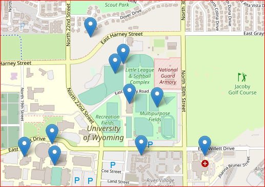

## Univ of Wyoming - Campus Locations on Map
### Description
An interactive map of University of Wyoming with few important locations of the campus highlighted on map. I graduated from "Univ of Wyoming", Laramie in 1996 with M.S.E.E, and M.S.Finance diplomas.

Creation of this leaflet map is an assignment in "Data Products" one of the courses towards a certificaton as a "Data Science Specialist".  It was a simple assignment, but fulfilling.

### Sites On Map
1. Univ of Wyoming
2. War Memorial Stadium
3. Ivinson Memorial Hospital", 
4. Multipurpose Fields
5. Indoor Tennis Complex
6. Laramie, Soccer Fields
7. Laramie Park", 
8. Univ of Wyoming Apartments
9. College of Law
10. Arena Auditorium

Latitude and Longitude values were copied manually from interactive [Google Maps](https://maps.google.com)

### Univ of Wyoming, Laramie.

  
[Interactive Map on RPubs by RStudio](https://rpubs.com/jyanamandala/univofwyo_leaflet)

